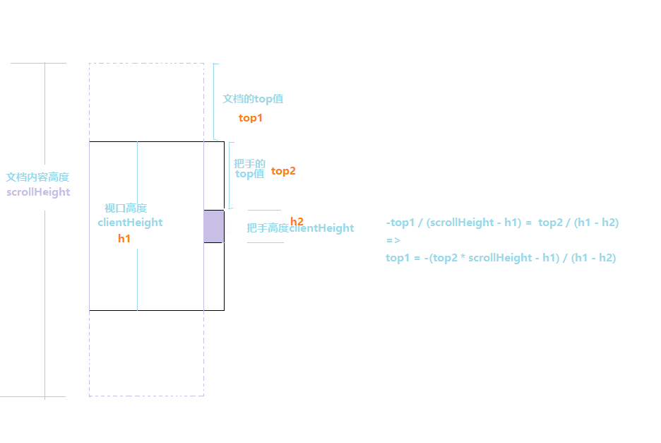

### 目的： 使用mvvm模式 设计 弹幕发送demo
### 分析
  1.  使用html和css创建视图        
  2.  创建模型构造函数
	- 存放弹幕数据
	- 暴露数据增删方法
  3. 创建试图模型构造函数
	- 绑定发送弹幕元素dom
    	- 动态创建元素        
    	- 绑定弹幕显示区域列表元素
    	- 自定义弹幕显示滚动条
    	- 绑定事件
       	   1. 弹幕增加一条发送事件
           2. 自定义滚动条滚动手柄显示事件

  4. 根据模型存放的弹幕数据自动发送弹幕(自动装弹)


#### 
	
  - 使用bind方法代替var that = this
  - 使用~~16.5 代替 Math.floor(16.5)向下取整
  - 清除文字选中状态在mousemove事件中处理比在mousedown事件中处理效果好
  - 自定义滚动条
  	  
  - 发布订阅者模式（观察者模式Observer.js）
  - 对Date对象扩展方法 (Date_extend.js)
    
    ```
      Date.prototype.format = Date.prototype.format || function () {
        /*
          todo
        */
      }
    ```
  - 过滤敏感信息  使用正则表达式过滤敏感信息 (Util.js)
	```

		Utils.filterInfo = function (str) {
		    /*
		        过滤信息
		    */
		    var sensitiveInfo = ['卧槽','你妹','日','滚','傻逼','sb','我是你爹','bb','智障'],
		        i = 0,
		        len = sensitiveInfo.length
		    for (; i < len; i++) {
		        str = str.replace(new RegExp('('+ sensitiveInfo[i]+')','g'), function () {
		            return new Array(arguments[0].length + 1).join('*')
		        })
		    }
		    return str
		}		

	```
